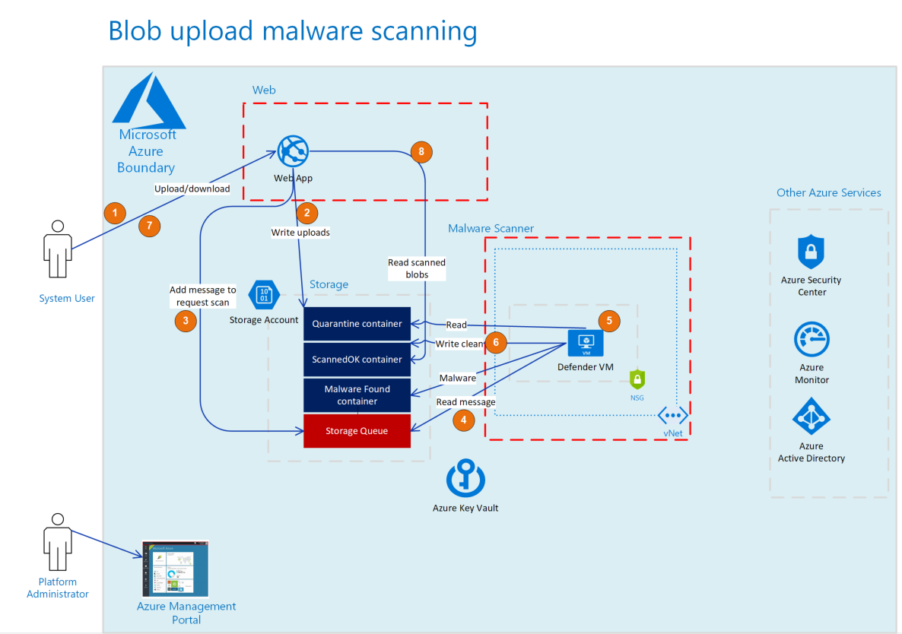

## Malware scanner for secure upload of Blobs to Azure Storage

### Problem statement
Users can upload files to Azure blob storage for others to download.

We don't want the files downloaded to contain Malware.

### Solution

1. User uploads a file to a web app
1. Web app stores upload in container (named **quarantine**)
1. Web app adds message to queue to request scan in [Azure Storage Queue](https://docs.microsoft.com/en-us/azure/storage/queues/storage-dotnet-how-to-use-queues?tabs=dotnet)
1. VM reads message and download file
1. VM scans for malware
1. A malware check is completed and either
  - If malware is found the file is moved to a container (named **malwarefound**) and deletes from quarantine
  - If file scan is OK then the file is moved to a container (named **scannedok**) and deletes from quarantine
7. Users of the application request download to web app
8. web app returns file from **ScannedOK** container

> Note: VM uses Managed Identity and KeyVault Policy to connect to KeyVault and request queue connection string and SAS tokens enabling read/write from containers 

### Deployment
Create 
1. Azure Storage account with 3 containers named quarantine, scannedok, malwarefound
1. Virtual Machine (with system managed identity) ensure you add antimalware and exclude the scanpath such as d:\scan - suggest a size such as DS3v2 with with [Accelerated Networking](https://docs.microsoft.com/en-us/azure/virtual-network/create-vm-accelerated-networking-cli)
1. Azure KeyVault
1. Add key vault policy to allow list, get secrets from KeyVault for VM managed identity
1. Add secrets to keyvault (note case sensitive)
 - **BlobSasToken** e.g. ?sv=2019-10-10&ss=b&srt=sco&sp=rwdlacx&se=2023-06-29T19:21:07Z&st=2020-06-29T11:21:07Z&spr=https&sig=7FFFFFFFFFFFFFAAAAAAAAAAAAA
 - **queueConnectionString** e.g. DefaultEndpointsProtocol=https;AccountName=example;AccountKey=1oPsXDAAAAAopDjlRkkg==;EndpointSuffix=core.windows.net
 - **workQueue** e.g. scanqueue
 
 ### Testing
 - Open the source code in visual studio, right click and select Publish to create a standalone EXE for windows, copy this onto the VM with the config file 
 - upload blob to quarantine container e.g. _example.txt
 - add a message with the filename of the blob e.g. _example.txt_ to the queue using the Azure portal (note do not  Encode the message body in Base64)
  
